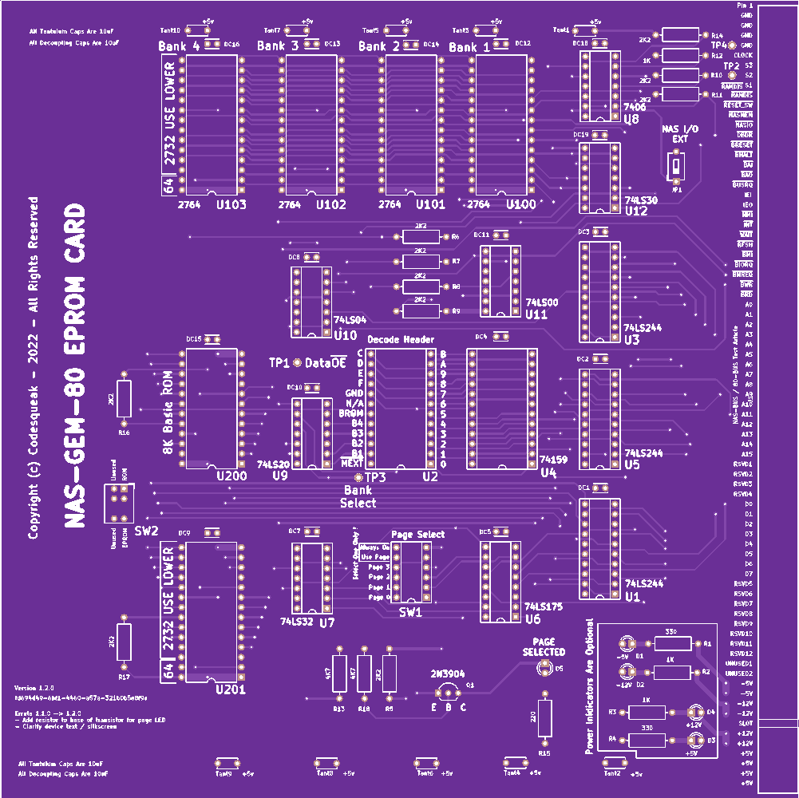

# NAS-GEM-80 EPROM CARD Version 1.2

This card has been designed to replace the use of 2708/2716 EPROM’s with the more readily available and simpler to program 2732 / 2764 devices.

## Introduction

The board support up 5 devices or 4 devices and the original 8K Basic ROM. Both a 2732/2764 EPROM and the Basic ROM may be present on the card simultaneously, with the active device being selected via a switch

Each device may be decoded to any 4K boundary, with a typical configuration being:

* 2732 decoded to D000 for NAS-DOS
* 2732 decoded to C000 for NAS-DIS & NAS-DEBUG
* 2764 decoded to E000 / F000 for 8K BASIC

The card also supports the Nascom Page Mode functionality, with any of the four pages being selectable via a DIL switch. If page 0 is selected then the card will be enabled at power up / reset.

The Page Mode functionality may also be disabled if required via a switch selection

NAS I/O selection is available via a link/switch.  This allows I/O on a Nascom to function correctly
M. EXT is supported for Nascom 1 usage.  This is selectable via a link

If the original 8K Basic ROM is being used, be aware that no wait states are generated on this card. Some slow devices may not function correctly without the use of wait states.

